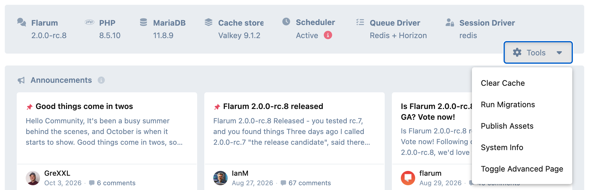

# Maintenance

 [](https://packagist.org/packages/ernestdefoe/maintenance)

Finish an extension install or update without opening a terminal. Maintenance
adds **Run Migrations** and **Publish Assets** to the admin dashboard's Tools
menu, right beside Clear Cache.



- **Run Migrations:** the in-process equivalent of `php flarum migrate`. Runs outstanding core and extension migrations, then reloads the admin so everything picks up the changes.
- **Publish Assets:** the equivalent of `php flarum assets:publish`. Republishes core fonts and every enabled extension's assets.
- **Tag counts that stay right.** With Flarum Tags installed, it recounts how many discussions each tag holds every night at 03:20. Flarum keeps that number as a running tally, so anything that tags discussions another way (an import, a restore, direct SQL) leaves it wrong for good. Run it by hand with `php flarum tags:recount`; it changes nothing when nothing has drifted.
- **Posts that survive a cache clear.** On a site whose cache is Redis but whose formatter keeps its own file store, a cache clear can leave every post failing to render. Maintenance makes the formatter rebuild itself instead, so one request pays a recompile and nobody sees an outage.

## Settings

None. It adds the two tools to the dashboard and that's all there is to it.

## Good to know

- **Admins only.** Both tools reject anyone who isn't an admin, and each run reports what it did, or points you to the Flarum log if it failed.
- **A good companion to the Extension Manager** on shared hosting, where there is no terminal to run these from.
- **The nightly recount needs the scheduler:** `php flarum schedule:run` from cron every minute.
- **Fully translatable.**

## Installation

```bash
composer require ernestdefoe/maintenance
php flarum cache:clear
```

Then enable **Maintenance** in the admin panel.

## Updating

```bash
composer update ernestdefoe/maintenance
php flarum cache:clear
```

## Support

- **Support forum:** [Maintenance on ernestdefoe.online](https://ernestdefoe.online/d/68)
- **Flarum community:** [Maintenance on discuss.flarum.org](https://discuss.flarum.org/d/39523-maintenance-for-flarum-2)
- **Bug reports:** [GitHub issues](https://github.com/ernestdefoe/maintenance/issues)

## Licence

MIT.
